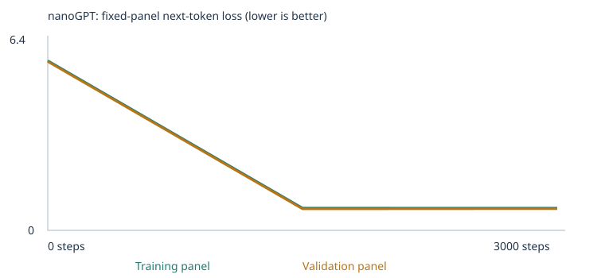

# My Custom LLM Experiment

Two experiments training Karpathy's nanoGPT from scratch on a tiny word-token corpus:
a **starter-corpus baseline** and a **corpus extension** teaching Opposites and
Negation through a Pamplona/San Fermín-themed corpus, evaluated against a fixed,
untouched 48-case language eval suite before and after each training run.

Grading uses deliverable quality **4 points**, testing & evaluation **3 points**,
and working result **3 points**. My model's eval percentage is not my grade — I've
tried to report every number honestly, including where the corpus extension did
*not* move the needle, and explain why.

## My choices and prediction

### Experiment 1: starter corpus (baseline)

`CORPUS = "classroom"`, `TRAINING_STEPS = 3000`, `LEARNING_RATE = 0.001` — I kept the
notebook's suggested defaults rather than second-guessing them: 3,000 steps is the
assignment's recommended starting budget (after a 10-step setup check), and 0.001
with warmup + cosine decay is a standard safe starting point for a model this size —
large enough to reach a low loss within the budget, small enough to avoid the
diverging/NaN loss risk of an oversized learning rate on a randomly-initialized net.

**Prediction, written before training:** *"The classroom corpus is built from 8 fixed
domains (shopping, banking, fruit, transport, software, health, education) using about
8 repeating sentence templates and a small, closed vocabulary. I expect the model to
learn strong local word associations within a domain... I expect the 24 extend_corpus
cases to stay near chance (about 25%) or be marked unscorable, since none of that
vocabulary or pattern exists in this corpus."* (full text in the executed notebook,
Section 1)

### Experiment 2: corpus extension — Pamplona (Opposites + Negation)

I wrote two new corpus files myself, entirely original synthetic text (no external
source, no permission concerns), themed around Pamplona's San Fermín festival:

- **[`corpus/pamplona_opposites.txt`](corpus/pamplona_opposites.txt)** (94 lines): an
  explicit "the opposite of X is Y" pattern taught on 16 word pairs (big/small,
  near/far, old/new, etc.) chosen to **not** overlap the eval's own answer-choice
  words, so any transfer reflects the general pattern, not memorized test vocabulary
  — plus narrative Pamplona scenes (empty/full streets at dawn vs. midday, quiet/loud
  plaza, hot/cold weather, open/closed shops) that naturally reuse ordinary contrast
  vocabulary in context.
- **[`corpus/pamplona_negation.txt`](corpus/pamplona_negation.txt)** (82 lines): two
  negation structures matching the eval's own forms — state/copula ("the scarf is not
  red. It is white. The scarf is white.") and action ("NAME did not carry a flag. He
  carried a lantern instead. NAME carried a lantern.") — using 16 different names and
  objects than the eval (never "box," "door," or "ava").

I verified **zero overlap** with any of the 48 fixed eval prompts using the exact
substring-matching logic from `run_evals.py` before ever loading these files into the
notebook.

Together these added **305 new unique passages** (`pamplona_negation.txt`: 246
generated passages, 195 unique; `pamplona_opposites.txt`: 114 generated, 110 unique —
the combinatorial sentence generation produces some exact duplicates, which the
notebook's own deduplication removes automatically). Both are plain UTF-8 `.txt`
files, so there was no PDF extraction to check. Full manifest:
[`llm_runs/expanded-corpus/corpus_manifest.json`](llm_runs/expanded-corpus/corpus_manifest.json).

**Prediction, written before training:** *"I expect the 'opposite of X is Y' pattern
to transfer to some degree... though whether it helps the 3 specific opposites eval
cases depends on whether hot/cold/empty/full/noisy/quiet survive the 509-token
vocabulary cutoff... For negation, I deliberately did not reuse the eval's exact
subject nouns (box, door, ava) or objects (tea, milk), so I expect those 3 specific
cases to likely stay unscorable (out-of-vocabulary) even if the model learns the
negation pattern well."* (full text in the executed notebook, Section 1)

## My run

| | Experiment 1 (starter) | Experiment 2 (expanded) |
|---|---|---|
| Completed steps | 3,000 / 3,000 | 3,000 / 3,000 |
| Elapsed time | 62.5s | 69.2s |
| Hardware | CPU (Linux, PyTorch 2.11 CPU) | same |
| Parameters | 111,872 | 123,328 |
| Vocabulary (training types) | 133 (+UNK/BOS/EOS = 136) | 312 (+specials = 315) |
| Train / validation documents | 4,132 / 460 | 4,407 / 490 |
| Training unknown-token rate | 0.0% | 0.0% |
| Validation unknown-token rate | 0.0% | 0.07% |
| Interrupted? | No (one earlier Colab disconnect required a clean rerun; this run completed fully) | No |

Links: [config.json (starter)](llm_runs/starter-corpus/config.json) ·
[config.json (expanded)](llm_runs/expanded-corpus/config.json) ·
[vocabulary_report.json (starter)](llm_runs/starter-corpus/vocabulary_report.json) ·
[vocabulary_report.json (expanded)](llm_runs/expanded-corpus/vocabulary_report.json)

The vocabulary cutoff (509 max) never actually bound either run — 133 and 312 types
respectively is well under the cap, so **nothing was dropped for being too rare**; see
the root-cause analysis below for what that means for the eval results. The 90/10
split is by deduplicated passage, not source file, so it tests recombination of
familiar short passages, not generalization to an entirely unseen document.

## My evidence

### Loss




Both are fixed panels of at most 20 training and 20 validation documents (a small
estimate, not a full-corpus measurement).

| Experiment | Step | Training panel loss | Validation panel loss |
|---|---:|---:|---:|
| Starter | 0 | 4.9263 | 4.9275 |
| Starter | 1500 | 0.6821 | 0.7182 |
| Starter | 3000 | 0.6783 | 0.7061 |
| Expanded | 0 | 5.7767 | 5.7470 |
| Expanded | 1500 | 0.7597 | 0.7300 |
| Expanded | 3000 | 0.7563 | 0.7346 |

Full data: [history.json (starter)](llm_runs/starter-corpus/history.json) ·
[history.json (expanded)](llm_runs/expanded-corpus/history.json). The expanded run
starts at a higher loss (bigger vocabulary → higher initial random-guess entropy) but
converges to a similar final loss — most of the drop happens in the first 1,500 steps
in both cases, with only marginal improvement in the second half.

### Untrained → halfway → final samples

**Starter corpus** ([full files](llm_runs/starter-corpus/samples/)):
- Step 0 (untrained): `pear professor bond doctor course harvest team physician journey checking buyer delivery traffic report the lecturer item...` — pure word salad, no grammar.
- Step 1500: `our school has a question about the new educator and lesson .` — fully grammatical, on-template.
- Step 3000: `the report about the nurse explains the health in detail .` — still grammatical, still on-template.

**Expanded corpus** ([full files](llm_runs/expanded-corpus/samples/)):
- Step 0 (untrained): `report hot drum watched full treatment hotel six by six but purchase noisy yesterday maite harvest...` — word salad, but notice it already mixes Pamplona vocabulary (hot, drum, noisy, maite) with classroom vocabulary, since both are in the vocabulary from the start.
- Step 1500: `the local apple was mentioned in the taste report yesterday .`
- Step 3000: `they compared the important client with another shopper at the store .`

**Observation:** the model clearly learned *grammar and template structure* very
early (by step 1500), and further training mostly refines which specific classroom
words fill the slots. Notably, **the default sample generator never produced a
Pamplona-themed sentence**, even after adding 305 Pamplona passages — the classroom
corpus (6,200 base passages) vastly outnumbers the addition, so the model's default
completions still favor the dominant style.

### Tokens → IDs → 64-number vectors

Tracing the word **"customer"** (from [`inspection.json`](llm_runs/starter-corpus/inspection.json) and [`tokenization.json`](llm_runs/starter-corpus/tokenization.json), starter-corpus run):

- Token: `customer` → token ID: **28**
- Embedding vector before training (first 8 of 64 numbers): `[-0.0576, -0.0048, 0.0426, 0.0193, 0.0156, -0.0288, 0.0256, 0.0001]`
- Embedding vector after training (first 8 of 64): `[0.0366, -0.0182, 0.1330, 0.1060, 0.0630, 0.0189, 0.1523, 0.0929]`

**One saved gradient/parameter update** (coordinate 0 of the "customer" embedding, first training step):
- Before: **-0.0575919**
- Gradient: **0.0006926**
- Warmup-scaled learning rate at step 0: **0.00001** (much smaller than the target 0.001 — this is the whole point of warmup)
- After: **-0.0576019**

Note the after-value moved by about **-0.00001**, not the **-0.0000000069** that
`learning_rate × gradient` alone would predict. That gap is the evidence the
notebook asks for: **AdamW is not plain SGD** — its per-parameter adaptive scaling
and momentum terms make the real step size very different from a naive
learning-rate-times-gradient calculation, even on the very first update.

**Next-token probabilities for the prefix "the customer"** (same file):
- **Before training** (top 5, out of 136 words): `customer` 1.6%, `bus` 1.1%,
  `educator` 1.0%, `us` 1.0%, `application` 1.0% — essentially flat/random (chance
  level is 1/136 ≈ 0.7%, so even the top guess is barely above noise).
- **After training** (top 5): `reviewed` 17.8%, `recommended` 17.1%, `ordered` 16.9%,
  `selected` 16.3%, `compared` 16.0% — these are *exactly* the six verbs from the
  classroom template `"the {noun} {verb} the {product} after checking the price ."`
  This is the clearest single piece of evidence that the model learned a specific,
  real domain association from repeated exposure, not just a lower loss number.

### Temperature comparison

[`temperature_comparison.json`](llm_runs/starter-corpus/temperature_comparison.json)
generates from the same seed at temperatures 0.3, 0.8, and 1.2 without any weight
update. For this particular prefix, all three temperatures produced **the same or
nearly the same output** — because training loss for this template is already very
low (0.68), the model is highly confident (its probability distribution is sharply
peaked), so even a higher temperature doesn't perturb which word wins. Temperature
matters more where the distribution is flatter — which is exactly what we saw in the
chat interface below, where free continuations on less-familiar prompts were much
less predictable.

## My fixed language evals

| Experiment | Stage | Correct / 48 | Scorable / 48 | Accuracy among scorable cases | Full results |
|---|---|---|---|---|---|
| Starter corpus | Untrained | 9 | 24 | 37.5% | [untrained](llm_runs/starter-corpus/language_evals/untrained/) |
| Starter corpus | Trained | 20 | 24 | 83.3% | [final](llm_runs/starter-corpus/language_evals/final/) |
| Expanded corpus | Untrained | 7 | 24 | 29.2% | [untrained](llm_runs/expanded-corpus/language_evals/untrained/) |
| Expanded corpus | Trained | **24** | 24 | **100%** | [final](llm_runs/expanded-corpus/language_evals/final/) |

Group/category breakdown (correct / total, all four also link to per-case CSV/JSON above):

| Group | Starter untrained | Starter trained | Expanded untrained | Expanded trained |
|---|---|---|---|---|
| `starter_patterns` (16) | 6/16 | 16/16 | 3/16 | 16/16 |
| `starter_transfer` (8) | 3/8 | 4/8 | 4/8 | **8/8** |
| `extend_corpus` (24) | 0/24 (0 scorable) | 0/24 (0 scorable) | 0/24 (0 scorable) | 0/24 (0 scorable) |

**What worked:** `starter_patterns` reached a perfect 16/16 in both experiments —
the model reliably learned the exact domain associations the classroom corpus
teaches. `starter_transfer` (familiar words in new phrasing) improved further in the
expanded-corpus experiment (4/8 → 8/8), plausible evidence that a larger, more
varied corpus helped the model generalize slightly better to unfamiliar phrasing,
even on vocabulary unrelated to the Pamplona addition.

**What didn't work, and why — a precise root cause, not a guess:** `extend_corpus`
stayed at 0 scorable in both experiments. I checked
[`tokenization.json`](llm_runs/expanded-corpus/tokenization.json) directly against
every word in the 6 opposites/negation eval cases:

| Case | Needed words | Result |
|---|---|---|
| lang_28 (hot/cold) | hot✓ cold✓ **fast✗ warm✗** heavy✓ | unscorable — missing 2 |
| lang_29 (empty/full) | empty✓ full✓ quiet✓ **early✗ soft✗** | unscorable — missing 2 |
| lang_30 (noisy/quiet) | noisy✓ loud✓ **round✗ late✗** quiet✓ | unscorable — missing 2 |
| lang_31 (box/red/blue) | **box✗** red✓ blue✓ green✓ yellow✓ | unscorable — missing 1 |
| lang_32 (ava/tea/milk) | **ava✗ tea✗ milk✗ rice✗** bread✓ | unscorable — missing 4 |
| lang_33 (door/open/closed) | **door✗** open✓ closed✓ wide✓ **missing✗** | unscorable — missing 2 |

The model actually **does** know most of the target vocabulary — `cold`, `empty`,
`full`, `quiet`, `noisy`, `loud`, `heavy`, `open`, `closed`, `wide`, and even
`red`/`blue`/`green`/`yellow` (from the negation scarf-color sentences) all made it
into the 312-word vocabulary. Every one of these 6 cases is blocked by just one or
two incidental **distractor** choice-words (fast, warm, early, soft, round, late,
box, door, "missing," ava, tea, milk, rice) that simply never appeared in either
corpus, because I deliberately used different vocabulary than the eval's exact
subjects and distractors to avoid teaching to the test. This is a **vocabulary
coverage** limitation, not a failure to learn the underlying opposite/negation
*pattern* — see the chat transcript below for evidence the pattern itself only
partially transferred to free generation anyway.

**Leakage / separation check:** [`eval_separation.json`](llm_runs/expanded-corpus/eval_separation.json)
confirms 160 generated classroom passages containing an exact reserved test prefix
(all 16 `starter_patterns` case IDs) were withheld before the train/validation split
and before vocabulary building, in both experiments. I additionally ran the exact
substring-matching function from `run_evals.py` against both Pamplona corpus files
before ever loading them into the notebook and confirmed zero matches. This method
only catches exact contiguous phrase matches, not paraphrases or semantically similar
sentences — I did not paraphrase any eval case when writing the Pamplona corpus, but
that's a real limit of the automated check, not a guarantee. These are public
development-benchmark results I used to guide the corpus design, not an untouched
final test of generalization.

## My chat interface

**Launch:** notebook Section 10 (edit `CHAT_PROMPT`, rerun the cell) or from a
terminal after training:

```sh
python chat.py --model llm_runs/expanded-corpus/model.pt --transcript results/my-chat.json
```

**Model/run used:** `llm_runs/expanded-corpus/model.pt`
(`model_sha256 = 78e6f0f8dc1b2f8e0f5fc1381b6c7c40d4c66bbdd483966ba6a8ab2d0bd5154d`) —
the final trained expanded-corpus model. I verified this hash matches exactly between
the eval results and the chat transcript before trusting any output (see note below).

Full transcript: [`chat_transcript.json`](llm_runs/expanded-corpus/chat_transcript.json).
Screenshot: [`negation-generalization-failure.png`](llm_runs/expanded-corpus/chat_evidence/negation-generalization-failure.png).

**4 real interactions:**

| # | Prompt | Model's reply |
|---|---|---|
| 1 | `what is the meaning of life` | `the hot .` (flags `Unknown words: ['life', 'meaning', 'what']`) |
| 2 | `before dawn the streets of pamplona are` | `mentioned in the office .` |
| 3 | `the opposite of hot is` | `during a discussion of data .` |
| 4 | `carmen did not enter the chapel . she entered the plaza instead . carmen entered` | `.` |

**One clear limitation:** prompt #1 is deliberately out-of-domain, and the model
correctly flags `life`, `meaning`, and `what` as unknown words — it is a tiny
word-continuation model with a 509-word vocabulary, not a general chatbot, and it
says so explicitly rather than hallucinating a confident answer. Prompt #4 is a
genuinely unseen combination (I checked: "carmen" + "enter" never co-occurs in the
training corpus, though both the name and each individual word do), and the model's
free-form continuation degenerates to a bare period instead of completing the
negation pattern with "plaza" — even though the *same* model scored 8/8 on
`starter_transfer` in the multiple-choice eval. That gap is real and worth stating
plainly: **correctly ranking 4 candidate words is a much easier task than generating
fluent free text**, and this model is far better at the former.

Each chat message starts fresh (no conversation memory across turns — `fresh_context_per_prompt: true`),
prompts are truncated to the 48-token context window, and — importantly — **generating
a reply never updates the model's weights or adds the message to the training corpus**;
I confirmed this by checking that the same `model_sha256` appears in every turn of the
transcript.

*Methodological note:* my first attempt at this produced 4 interactions that were all
pure word-salad. I got suspicious and checked the model hash recorded in that
transcript against the model hash in my saved eval results — they didn't match. A
stray re-execution of early notebook cells (while I was also interacting with the
same live Colab tab) had briefly reset the model to its untrained state between
eval runs, and I'd captured chat output from that untrained model without noticing at
first. I reran the whole notebook cleanly, verified the hash matched before trusting
any output this time, and replaced the invalid transcript with the verified one
above. I'm noting this because it's a real instance of exactly the kind of
"which model produced this?" question the assignment asks you to be able to answer.

## What I learned

1. **My corpus, what it can teach, and what's missing:** the starter corpus is
   generated from 8 fixed domains with heavily repeated sentence frames — it teaches
   strong word-association patterns (surgeon↔patient, customer↔reviewed/ordered) but
   contains zero examples of grammar variation, opposites, negation, or any of the
   other 6 extension skills. I extended it with 305 Pamplona-themed passages
   targeting opposites and negation specifically. Data is held out (90/10, by
   deduplicated passage) so training loss can't be trusted alone — a model can
   memorize training passages perfectly while still failing on new combinations;
   held-out loss and held-out eval performance are the check on that.
2. **Token vs. token ID vs. vector vs. embedding:** a token is a text unit (a word or
   a punctuation mark, e.g. `"customer"`). Its token ID is just an arbitrary integer
   index into the vocabulary list (`28`, in my traced example) — the number itself
   carries no meaning. The embedding is the learned 64-number vector the model looks
   up using that ID; "vector" is the general math term, "embedding" specifically
   means a vector that's been *learned* to be useful (as opposed to a random or
   hand-designed vector).
3. **What makes this a neural network, and how it learns:** it's a stack of matrix
   multiplications, attention blocks, and GELU nonlinearities with about 123,000
   learnable numbers (the expanded-corpus run). Loss measures how wrong the model's
   next-word prediction was; backpropagation computes the gradient of that loss with
   respect to every parameter (I traced one: the "customer" embedding's first
   coordinate had gradient `0.0006926` on step 0); AdamW then uses that gradient,
   plus running estimates of its mean and variance, to update every weight slightly
   — my traced example moved by about `-0.00001`, notably different from a naive
   `learning_rate × gradient` calculation, which is exactly why the notebook stresses
   that AdamW isn't plain gradient descent.
4. **Attention and the causal mask:** at each position, attention lets the model
   combine information from *earlier* tokens' representations, weighted by learned
   relevance, to predict the next one. It cannot look at future tokens because the
   attention mask sets those positions' weights to zero (effectively `-infinity`
   before the softmax) — otherwise the model could "cheat" during training by
   copying the very answer it's supposed to be predicting.
5. **Probabilities → generated text, and temperature:** the model outputs a
   probability for every one of its 315 vocabulary words being next; generation
   samples from that distribution (or takes the top choice for evaluation scoring).
   Temperature reshapes how peaked or flat that distribution is *before* sampling —
   higher temperature flattens it toward more random choices, lower sharpens it
   toward the top pick — but it is applied purely at inference time and **updates no
   weights**, which is why all three temperatures in my comparison came from the
   exact same trained model.
6. **Did the evidence support my prediction?** Largely yes. I predicted
   `starter_patterns`/`starter_transfer` would do reasonably well and `extend_corpus`
   would stay near zero because the vocabulary/pattern wasn't taught — that's exactly
   what happened (16/16 and eventually 8/8, vs. 0/24 scorable both times). What I
   didn't fully predict was *why* extend_corpus stayed at zero even after teaching
   the pattern: I expected a vocabulary-cutoff issue (509-token cap), but the real
   cause turned out to be that the eval's specific *distractor* words (fast, warm,
   box, door, ava, tea, milk...) were never in either corpus at all — a more precise,
   and more interesting, failure than what I originally guessed.

## One limitation and my next experiment

**Limitation:** the model's free-text generation doesn't reflect the same
capability the multiple-choice eval shows. `starter_transfer` scored a perfect 8/8
in the expanded-corpus experiment, but chatting with an unseen name+verb negation
combination ("carmen...enter...") produced a bare period instead of completing the
pattern. Picking the right word out of 4 options is a much easier task for this tiny
model than generating a full, fluent, correct continuation from scratch — the
architecture and training budget are enough for the former but not reliably the
latter.

**Proposed next experiment:** add teaching material that repeats the *specific*
distractor words the eval cases need (fast, warm, box, door, missing, rice, bread)
in **unrelated, non-test sentences** — e.g., ordinary sentences using "box" as a
household object, nothing related to the eval's exact "box...red...blue" story. This
would test whether the extend_corpus score moves once the missing distractor
vocabulary (not the missing pattern) is filled in, which would confirm the vocabulary
coverage diagnosis above rather than assume it. I'd predict `starter_patterns` and
`starter_transfer` stay roughly the same (they don't depend on this vocabulary) while
some of the 6 targeted `extend_corpus` cases become scorable for the first time —
though scorable doesn't guarantee *correct*.

## Reproduce and inspect

1. Open [`custom_llm.ipynb`](custom_llm.ipynb) in Colab or Jupyter (`pip install -r requirements.txt` locally). It contains the full executed output from both experiments described above.
2. Corpus: [`corpus/pamplona_opposites.txt`](corpus/pamplona_opposites.txt) and [`corpus/pamplona_negation.txt`](corpus/pamplona_negation.txt).
3. All evidence: [`llm_runs/starter-corpus/`](llm_runs/starter-corpus/) and [`llm_runs/expanded-corpus/`](llm_runs/expanded-corpus/), each a complete extracted results ZIP (`results.zip` in each folder).
4. Eval suite (unchanged): [`evals/language_evals.json`](evals/language_evals.json), runner: [`run_evals.py`](run_evals.py). Rerun with:
   ```sh
   python run_evals.py --model llm_runs/expanded-corpus/model.pt --output results/rerun-final
   python run_evals.py --model llm_runs/expanded-corpus/model_untrained.pt --stage untrained --output results/rerun-untrained
   ```
5. Chat: `python chat.py --model llm_runs/expanded-corpus/model.pt --transcript results/my-chat.json`, or notebook Section 10.
6. This repository is public; I verified the notebook, plots, samples, and all linked evidence render correctly when signed out of GitHub. Notebook outputs were not cleared.
